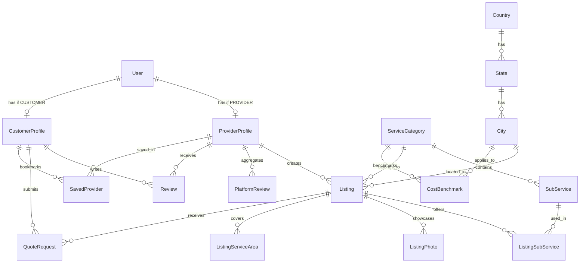

# Database Schema Design — FindYourExperts
**Project**: FindYourExperts (Marketplace for Local Service Providers — Sharetribe-inspired)  
**Architecture Model**: Multi-sided marketplace — Providers list services, Customers discover & request quotes  
**Target Pilot**: USA → New York City (NYC) → Roofing Services  
**Scalability**: Multi-Country, Multi-City, Multi-Service (no schema changes needed)  
**Tech Stack**: Prisma ORM + Supabase PostgreSQL + PostGIS (geography)

---

## 1. Core Design Principles

```
┌──────────────────────────────────────────────────────────────────┐
│                  FindYourExperts — Marketplace Model              │
│               (Sharetribe-inspired 3-sided platform)             │
└──────────────────────────────────────────────────────────────────┘
          │                    │                    │
          ▼                    ▼                    ▼
   ┌─────────────┐    ┌──────────────┐    ┌──────────────┐
   │   ADMIN     │    │   PROVIDER   │    │   CUSTOMER   │
   │  Platform   │    │  Business    │    │  Homeowner / │
   │  Operator   │    │  Owner       │    │  Client      │
   └─────────────┘    └──────────────┘    └──────────────┘
    • Manage users     • List business     • Browse providers
    • Moderate content • Multiple services • Request quotes
    • Analytics        • Portfolio photos  • Save/Compare
    • Verify providers • Respond to leads  • Leave reviews
```

### Key Design Decisions

| Decision | Rationale |
|:---|:---|
| **Single `users` table + separate profile tables** | Auth is unified (one login). Role-specific data lives in `provider_profiles` and `customer_profiles`. Clean separation of concerns. |
| **One provider → many services** | A roofing company can also do gutters, waterproofing, etc. Uses `listings` (like Sharetribe) to represent each service offering. |
| **PostGIS geography columns** | Enables "find providers near me" with `ST_DWithin()` distance queries, bounding-box search, and radius-based filtering. |
| **Separate `listings` table** | Like Sharetribe — a Provider creates "listings" for each service they offer. Each listing has its own description, pricing, photos, and service area. |
| **Soft-delete with `isActive` flags** | No hard deletes; preserves data integrity for analytics and audit trails. |

---

## 2. Entity Relationship (ER) Diagram



---

## 3. User System (3 Roles: Admin, Provider, Customer)

### 3.1. Enums

```prisma
enum UserRole          { ADMIN  PROVIDER  CUSTOMER }
enum AuthProvider      { EMAIL  GOOGLE  FACEBOOK }
enum AccountStatus     { ACTIVE  SUSPENDED  DEACTIVATED  PENDING_VERIFICATION }
```

### 3.2. Table: `users`
Single authentication table for all user types. Role determines which profile table is linked.

| Column | Type | Nullable | Default | Constraints | Description |
|:---|:---|:---|:---|:---|:---|
| `id` | `UUID` | No | `uuid()` | `PK` | Unique user identifier |
| `email` | `VARCHAR(255)` | No | — | `UNIQUE` | Login email address |
| `passwordHash` | `VARCHAR(255)` | Yes | NULL | — | Bcrypt/Argon2 hash (NULL for OAuth users) |
| `role` | `UserRole` | No | `CUSTOMER` | — | `ADMIN`, `PROVIDER`, or `CUSTOMER` |
| `authProvider` | `AuthProvider` | No | `EMAIL` | — | How user authenticated |
| `authProviderId` | `VARCHAR(255)` | Yes | NULL | — | External OAuth ID (Google/FB) |
| `emailVerified` | `BOOLEAN` | No | `false` | — | Email confirmation status |
| `status` | `AccountStatus` | No | `ACTIVE` | — | Account lifecycle status |
| `lastLoginAt` | `TIMESTAMPTZ` | Yes | NULL | — | Most recent login timestamp |
| `createdAt` | `TIMESTAMPTZ` | No | `now()` | — | Account creation |
| `updatedAt` | `TIMESTAMPTZ` | No | `now()` | — | Last profile update |

---

### 3.3. Table: `provider_profiles`
Business profile for service providers. **One User → One ProviderProfile**.  
Provider can have **multiple Listings** (different services they offer).

| Column | Type | Nullable | Default | Constraints | Description |
|:---|:---|:---|:---|:---|:---|
| `id` | `UUID` | No | `uuid()` | `PK` | Provider profile UUID |
| `userId` | `UUID` | No | — | `UNIQUE FK → users(id) ON DELETE CASCADE` | Owning user account |
| `businessName` | `VARCHAR(255)` | No | — | — | Legal / DBA company name |
| `slug` | `VARCHAR(255)` | No | — | `UNIQUE` | URL slug: `/providers/[slug]` |
| `tagline` | `VARCHAR(255)` | Yes | NULL | — | One-liner (e.g., "Historic Brownstone & Slate Specialist") |
| `description` | `TEXT` | No | — | — | Full business overview / editorial bio |
| `logoUrl` | `TEXT` | Yes | NULL | — | Company logo asset URL |
| `logoText` | `VARCHAR(50)` | Yes | NULL | — | Text-based logo fallback |
| `coverImageUrl` | `TEXT` | Yes | NULL | — | Hero/cover image for profile page |
| `phone` | `VARCHAR(30)` | No | — | — | Business phone (e.g., "7185550192", format in code) |
| `email` | `VARCHAR(255)` | Yes | NULL | — | Public business email (can differ from login) |
| `websiteUrl` | `TEXT` | Yes | NULL | — | External website |
| **Geography Fields** | | | | | |
| `address` | `VARCHAR(255)` | No | — | — | Display address (e.g., "123 Main St, Staten Island, NY") |
| `city` | `VARCHAR(100)` | Yes | NULL | — | City name |
| `state` | `VARCHAR(100)` | Yes | NULL | — | State/Province |
| `zipCode` | `VARCHAR(20)` | Yes | NULL | — | Postal code |
| `borough` | `VARCHAR(100)` | Yes | NULL | — | NYC-specific sub-region |
| `latitude` | `DECIMAL(10,7)` | Yes | NULL | — | GPS latitude for map pin |
| `longitude` | `DECIMAL(10,7)` | Yes | NULL | — | GPS longitude for map pin |
| `location` | `GEOGRAPHY(Point, 4326)` | Yes | NULL | — | PostGIS point for spatial queries (auto-computed from lat/lng) |
| `serviceRadius` | `INT` | Yes | `25` | — | Service coverage radius in miles |
| **Credentials & Verification** | | | | | |
| `licenseNumber` | `VARCHAR(100)` | Yes | NULL | — | Official license (e.g., "NYC-HIC #2049182") |
| `sinceYear` | `INT` | No | — | — | Year founded (compute `yearsInBusiness` in code as `currentYear - sinceYear`) |
| `isLicensed` | `BOOLEAN` | No | `false` | — | License verified |
| `isInsured` | `BOOLEAN` | No | `false` | — | Insurance verified |
| `isBonded` | `BOOLEAN` | No | `false` | — | Surety bond verified |
| `hasWarranty` | `BOOLEAN` | No | `false` | — | Warranty offered |
| `financingAvailable` | `BOOLEAN` | No | `false` | — | Financing plans available |
| `emergencyService` | `BOOLEAN` | No | `false` | — | 24/7 emergency dispatch |
| `bbbRating` | `VARCHAR(10)` | Yes | NULL | — | BBB grade (e.g., "A+") |
| `verifiedYear` | `INT` | Yes | NULL | — | Year editorial vetting was done |
| **Aggregated Scores (Denormalized)** | | | | | |
| `compositeRating` | `DECIMAL(2,1)` | No | `0.0` | — | Weighted aggregate across all platforms |
| `totalReviews` | `INT` | No | `0` | — | Total combined review count |
| **Status & Administration** | | | | | |
| `isVerified` | `BOOLEAN` | No | `false` | — | Admin-approved verification |
| `isFeatured` | `BOOLEAN` | No | `false` | — | Boosted/promoted listing |
| `isActive` | `BOOLEAN` | No | `true` | — | Visible in public directory |
| `badge` | `VARCHAR(100)` | Yes | NULL | — | Display badge (e.g., "Top Pick NYC 2026") |
| `topPickCategory` | `TopPickCategory` | Yes | NULL | — | Editorial pick category |
| `featuredQuote` | `TEXT` | Yes | NULL | — | Highlighted customer testimonial |
| `createdAt` | `TIMESTAMPTZ` | No | `now()` | — | Profile creation |
| `updatedAt` | `TIMESTAMPTZ` | No | `now()` | — | Last update |

**Key Indexes**:
- `@@index([borough])` — Borough-based filtering
- `@@index([compositeRating(sort: Desc)])` — Top rated sorting
- `@@index([totalReviews(sort: Desc)])` — Most reviewed sorting
- `@@index([sinceYear])` — Experience sorting (sort ASC = most experienced first)
- Spatial index on `location` — PostGIS `GIST` index for proximity search

---

### 3.4. Table: `customer_profiles`
Profile for homeowners / clients who browse and request quotes.

| Column | Type | Nullable | Default | Constraints | Description |
|:---|:---|:---|:---|:---|:---|
| `id` | `UUID` | No | `uuid()` | `PK` | Customer profile UUID |
| `userId` | `UUID` | No | — | `UNIQUE FK → users(id) ON DELETE CASCADE` | Owning user account |
| `fullName` | `VARCHAR(150)` | Yes | NULL | — | Customer display name |
| `phone` | `VARCHAR(30)` | Yes | NULL | — | Contact phone |
| `avatarUrl` | `TEXT` | Yes | NULL | — | Profile picture |
| **Geography Fields** | | | | | |
| `address` | `VARCHAR(255)` | Yes | NULL | — | Home/property address |
| `city` | `VARCHAR(100)` | Yes | NULL | — | City |
| `state` | `VARCHAR(100)` | Yes | NULL | — | State |
| `zipCode` | `VARCHAR(20)` | Yes | NULL | — | Postal code |
| `borough` | `VARCHAR(100)` | Yes | NULL | — | NYC sub-region |
| `latitude` | `DECIMAL(10,7)` | Yes | NULL | — | GPS latitude |
| `longitude` | `DECIMAL(10,7)` | Yes | NULL | — | GPS longitude |
| `location` | `GEOGRAPHY(Point, 4326)` | Yes | NULL | — | PostGIS point for distance queries |
| **Preferences** | | | | | |
| `preferredContactMethod` | `ContactMethod` | No | `EMAIL` | — | How they want to be reached |
| `propertyType` | `PropertyType` | Yes | NULL | — | Residential or Commercial |
| `createdAt` | `TIMESTAMPTZ` | No | `now()` | — | Profile creation |
| `updatedAt` | `TIMESTAMPTZ` | No | `now()` | — | Last update |

---

## 4. Geography System (Location Search)

### 4.1. How Location Search Works

```
┌──────────────────────────────────────────────────────────────┐
│                    Location Search Pipeline                    │
└──────────────────────────────────────────────────────────────┘

  Customer enters address/zip → Geocode to lat/lng →

  Query 1: Traditional Filter
  ┌────────────────────────────────────────────┐
  │ WHERE borough = 'Brooklyn'                 │
  │   AND city = 'New York City'               │
  └────────────────────────────────────────────┘

  Query 2: Radius / Proximity Search (PostGIS)
  ┌────────────────────────────────────────────┐
  │ WHERE ST_DWithin(                          │
  │   provider.location,                       │
  │   customer.location,                       │
  │   25 * 1609.34  -- 25 miles in meters      │
  │ )                                          │
  │ ORDER BY ST_Distance(                      │
  │   provider.location,                       │
  │   customer.location                        │
  │ )                                          │
  └────────────────────────────────────────────┘
```

### 4.2. Geo Hierarchy Tables

#### Table: `countries`

| Column | Type | Nullable | Default | Constraints | Description |
|:---|:---|:---|:---|:---|:---|
| `id` | `UUID` | No | `uuid()` | `PK` | Country UUID |
| `name` | `VARCHAR(100)` | No | — | `UNIQUE` | e.g., "United States" |
| `code` | `VARCHAR(10)` | No | — | `UNIQUE` | e.g., "US" |
| `slug` | `VARCHAR(100)` | No | — | `UNIQUE` | e.g., "usa" |
| `createdAt` | `TIMESTAMPTZ` | No | `now()` | — | Record creation |

#### Table: `states`

| Column | Type | Nullable | Default | Constraints | Description |
|:---|:---|:---|:---|:---|:---|
| `id` | `UUID` | No | `uuid()` | `PK` | State UUID |
| `countryId` | `UUID` | No | — | `FK → countries(id) ON DELETE CASCADE` | Parent country |
| `name` | `VARCHAR(100)` | No | — | — | e.g., "New York" |
| `code` | `VARCHAR(10)` | No | — | — | e.g., "NY" |
| `slug` | `VARCHAR(100)` | No | — | — | e.g., "new-york" |
| `createdAt` | `TIMESTAMPTZ` | No | `now()` | — | Record creation |

*Unique Index*: `[countryId, slug]`

#### Table: `cities`

| Column | Type | Nullable | Default | Constraints | Description |
|:---|:---|:---|:---|:---|:---|
| `id` | `UUID` | No | `uuid()` | `PK` | City UUID |
| `stateId` | `UUID` | No | — | `FK → states(id) ON DELETE CASCADE` | Parent state |
| `name` | `VARCHAR(100)` | No | — | — | e.g., "New York City" |
| `slug` | `VARCHAR(100)` | No | — | — | e.g., "new-york-city" |
| `boroughs` | `TEXT[]` | No | `[]` | — | Sub-regions list |
| `zipCodes` | `TEXT[]` | No | `[]` | — | Known postal codes |
| `latitude` | `DECIMAL(10,7)` | Yes | NULL | — | City center lat |
| `longitude` | `DECIMAL(10,7)` | Yes | NULL | — | City center lng |
| `location` | `GEOGRAPHY(Point, 4326)` | Yes | NULL | — | PostGIS point for city-level search |
| `heroTitle` | `VARCHAR(255)` | Yes | NULL | — | SEO title |
| `heroSubtitle` | `TEXT` | Yes | NULL | — | SEO description |
| `createdAt` | `TIMESTAMPTZ` | No | `now()` | — | Record creation |

*Unique Index*: `[stateId, slug]`

---

## 5. Service Taxonomy

### 5.1. Table: `service_categories`
Top-level trade verticals (Roofing, Plumbing, HVAC, etc.)

| Column | Type | Nullable | Default | Constraints | Description |
|:---|:---|:---|:---|:---|:---|
| `id` | `UUID` | No | `uuid()` | `PK` | Category UUID |
| `name` | `VARCHAR(100)` | No | — | `UNIQUE` | e.g., "Roofing" |
| `slug` | `VARCHAR(100)` | No | — | `UNIQUE` | e.g., "roofing" |
| `description` | `TEXT` | Yes | NULL | — | Category overview |
| `icon` | `VARCHAR(100)` | Yes | NULL | — | Icon key (Lucide/heroicons) |
| `metaTitle` | `VARCHAR(255)` | Yes | NULL | — | SEO page title |
| `metaDescription` | `TEXT` | Yes | NULL | — | SEO description |
| `createdAt` | `TIMESTAMPTZ` | No | `now()` | — | Record creation |

### 5.2. Table: `sub_services`
Granular services within a category (used for filters, listing tags, and quote requests).

| Column | Type | Nullable | Default | Constraints | Description |
|:---|:---|:---|:---|:---|:---|
| `id` | `UUID` | No | `uuid()` | `PK` | SubService UUID |
| `categoryId` | `UUID` | No | — | `FK → service_categories(id) ON DELETE CASCADE` | Parent category |
| `name` | `VARCHAR(120)` | No | — | — | e.g., "Flat Roof Systems" |
| `slug` | `VARCHAR(120)` | No | — | — | e.g., "flat-roof-systems" |
| `description` | `TEXT` | Yes | NULL | — | Service details |
| `isPopular` | `BOOLEAN` | No | `false` | — | Show in hero quick-tags |
| `createdAt` | `TIMESTAMPTZ` | No | `now()` | — | Record creation |

*Unique Index*: `[categoryId, slug]`

---

## 6. Listings (Sharetribe-inspired — Provider's Service Offerings)

### Design Philosophy
Like Sharetribe, each **Listing** represents a specific service offering by a Provider. A roofing company might have separate listings for "Full Roof Replacement", "Emergency Leak Repair", and "Gutter Installation" — each with its own pricing, photos, and service area.

```
Provider: "Empire State Roofing"
├── Listing 1: "Full Roof Replacement"  ($6,500 – $12,500)
│   ├── SubServices: [Flat Roof, Shingle, Waterproofing]
│   ├── Photos: [before-after-1.jpg, ...]
│   └── Service Areas: [Manhattan, Brooklyn, Queens]
├── Listing 2: "Emergency Leak Repair"  ($500 – $3,000)
│   ├── SubServices: [Emergency Leak Repair, Tarping]
│   └── Service Areas: [All Boroughs]
└── Listing 3: "Gutter Installation"    ($1,200 – $4,500)
    └── SubServices: [Gutter Installation]
```

### 6.1. Enums

```prisma
enum ListingStatus  { DRAFT  PENDING_REVIEW  ACTIVE  PAUSED  REJECTED  ARCHIVED }
enum PricingType    { FIXED  RANGE  HOURLY  QUOTE_ONLY }
enum AreaType       { BOROUGH  NEIGHBORHOOD  ZIP_CODE  CITY }
enum PhotoCategory  { HERO  PORTFOLIO  BEFORE_AFTER  CREW }
```

### 6.2. Table: `listings`

| Column | Type | Nullable | Default | Constraints | Description |
|:---|:---|:---|:---|:---|:---|
| `id` | `UUID` | No | `uuid()` | `PK` | Listing UUID |
| `providerProfileId` | `UUID` | No | — | `FK → provider_profiles(id) ON DELETE CASCADE` | Owning provider |
| `categoryId` | `UUID` | No | — | `FK → service_categories(id)` | Service category |
| `cityId` | `UUID` | No | — | `FK → cities(id)` | Primary city |
| `title` | `VARCHAR(255)` | No | — | — | Listing title (e.g., "Full Roof Replacement") |
| `slug` | `VARCHAR(255)` | No | — | `UNIQUE` | URL slug for listing page |
| `description` | `TEXT` | No | — | — | Full service description |
| `status` | `ListingStatus` | No | `DRAFT` | — | Publishing lifecycle |
| **Pricing** | | | | | |
| `pricingType` | `PricingType` | No | `RANGE` | — | How pricing is displayed |
| `minPrice` | `DECIMAL(10,2)` | Yes | NULL | — | Low estimate (format display string in code as `$min – $max`) |
| `maxPrice` | `DECIMAL(10,2)` | Yes | NULL | — | High estimate |
| **Metadata** | | | | | |
| `isFeatured` | `BOOLEAN` | No | `false` | — | Promoted listing |
| `viewCount` | `INT` | No | `0` | — | Page view counter |
| `createdAt` | `TIMESTAMPTZ` | No | `now()` | — | Listing creation |
| `updatedAt` | `TIMESTAMPTZ` | No | `now()` | — | Last update |

**Key Indexes**:
- `@@index([providerProfileId])` — Provider's listings
- `@@index([categoryId, cityId])` — Directory browsing
- `@@index([status])` — Admin moderation queue

### 6.3. Table: `listing_sub_services` (Many-to-Many)

| Column | Type | Nullable | Default | Constraints | Description |
|:---|:---|:---|:---|:---|:---|
| `id` | `UUID` | No | `uuid()` | `PK` | Join UUID |
| `listingId` | `UUID` | No | — | `FK → listings(id) ON DELETE CASCADE` | Parent listing |
| `subServiceId` | `UUID` | No | — | `FK → sub_services(id) ON DELETE CASCADE` | Tagged sub-service |
| `createdAt` | `TIMESTAMPTZ` | No | `now()` | — | Record creation |

*Unique Index*: `[listingId, subServiceId]`

### 6.4. Table: `listing_photos`

| Column | Type | Nullable | Default | Constraints | Description |
|:---|:---|:---|:---|:---|:---|
| `id` | `UUID` | No | `uuid()` | `PK` | Photo UUID |
| `listingId` | `UUID` | No | — | `FK → listings(id) ON DELETE CASCADE` | Parent listing |
| `imageUrl` | `TEXT` | No | — | — | CDN/S3 URL |
| `caption` | `VARCHAR(255)` | Yes | NULL | — | Photo description |
| `category` | `PhotoCategory` | No | `PORTFOLIO` | — | `HERO`, `PORTFOLIO`, `BEFORE_AFTER`, `CREW` |
| `orderIndex` | `INT` | No | `0` | — | Display sequence |
| `createdAt` | `TIMESTAMPTZ` | No | `now()` | — | Record creation |

*Index*: `@@index([listingId, orderIndex])`

### 6.5. Table: `listing_service_areas`
Which boroughs/neighborhoods a specific listing covers.

| Column | Type | Nullable | Default | Constraints | Description |
|:---|:---|:---|:---|:---|:---|
| `id` | `UUID` | No | `uuid()` | `PK` | UUID |
| `listingId` | `UUID` | No | — | `FK → listings(id) ON DELETE CASCADE` | Parent listing |
| `areaName` | `VARCHAR(100)` | No | — | — | e.g., "Manhattan", "Brooklyn", "All NYC" |
| `areaType` | `AreaType` | No | `BOROUGH` | — | `BOROUGH`, `NEIGHBORHOOD`, `ZIP_CODE`, `CITY` |
| `zipCode` | `VARCHAR(20)` | Yes | NULL | — | Optional specific zip |
| `createdAt` | `TIMESTAMPTZ` | No | `now()` | — | Record creation |

*Unique Index*: `[listingId, areaName]`

---

## 7. Reviews System

### 7.1. Table: `platform_reviews`
External review aggregation from Google, Yelp, Facebook, etc. (tied to Provider, not individual listings).

```prisma
enum ReviewPlatform { GOOGLE  YELP  FACEBOOK  HOMEADVISOR  BBB }
```

| Column | Type | Nullable | Default | Constraints | Description |
|:---|:---|:---|:---|:---|:---|
| `id` | `UUID` | No | `uuid()` | `PK` | Review record UUID |
| `providerProfileId` | `UUID` | No | — | `FK → provider_profiles(id) ON DELETE CASCADE` | Provider being reviewed |
| `platform` | `ReviewPlatform` | No | — | — | External platform |
| `rating` | `DECIMAL(2,1)` | No | — | — | Platform rating (e.g., 4.8) |
| `reviewCount` | `INT` | No | — | — | Number of reviews |
| `profileUrl` | `TEXT` | No | — | — | Direct verification link |
| `lastScrapedAt` | `TIMESTAMPTZ` | Yes | NULL | — | Last data sync |
| `updatedAt` | `TIMESTAMPTZ` | No | `now()` | — | Record update |

*Unique Index*: `[providerProfileId, platform]`

### 7.2. Table: `reviews`
In-platform reviews written by Customers about Providers.

| Column | Type | Nullable | Default | Constraints | Description |
|:---|:---|:---|:---|:---|:---|
| `id` | `UUID` | No | `uuid()` | `PK` | Review UUID |
| `customerProfileId` | `UUID` | No | — | `FK → customer_profiles(id) ON DELETE CASCADE` | Review author |
| `providerProfileId` | `UUID` | No | — | `FK → provider_profiles(id) ON DELETE CASCADE` | Reviewed provider |
| `listingId` | `UUID` | Yes | NULL | `FK → listings(id) ON DELETE SET NULL` | Specific service reviewed |
| `rating` | `INT` | No | — | `CHECK(1-5)` | 1-5 star rating |
| `title` | `VARCHAR(255)` | Yes | NULL | — | Review headline |
| `comment` | `TEXT` | Yes | NULL | — | Full review text |
| `isVerified` | `BOOLEAN` | No | `false` | — | Verified transaction review |
| `createdAt` | `TIMESTAMPTZ` | No | `now()` | — | Review submission |

*Unique Index*: `[customerProfileId, providerProfileId]` (one review per customer per provider)

---

## 8. Lead Generation & Quote Engine

### 8.1. Enums

```prisma
enum QuoteStatus    { PENDING  ASSIGNED  CONTACTED  COMPLETED  CANCELLED }
enum ProjectUrgency { EMERGENCY_24H  WITHIN_48H  WITHIN_A_WEEK  FLEXIBLE  PLANNING }
enum PropertyType   { RESIDENTIAL  COMMERCIAL }
enum ContactMethod  { EMAIL  PHONE  BOTH }
```

### 8.2. Table: `quote_requests`
Lead capture from QuoteModal or Provider profile page.

| Column | Type | Nullable | Default | Constraints | Description |
|:---|:---|:---|:---|:---|:---|
| `id` | `UUID` | No | `uuid()` | `PK` | Quote UUID |
| `trackingNumber` | `VARCHAR(50)` | No | — | `UNIQUE` | Human-readable ref (e.g., "FYE-2026-89412") |
| `listingId` | `UUID` | Yes | NULL | `FK → listings(id) ON DELETE SET NULL` | Target listing (NULL = broadcast) |
| `providerProfileId` | `UUID` | Yes | NULL | `FK → provider_profiles(id) ON DELETE SET NULL` | Target provider |
| `customerProfileId` | `UUID` | Yes | NULL | `FK → customer_profiles(id) ON DELETE SET NULL` | Logged-in customer (optional for anonymous) |
| **Customer Contact** | | | | | |
| `customerName` | `VARCHAR(150)` | No | — | — | Full name |
| `customerEmail` | `VARCHAR(150)` | No | — | — | Email |
| `customerPhone` | `VARCHAR(30)` | No | — | — | Phone |
| **Location** | | | | | |
| `borough` | `VARCHAR(100)` | Yes | NULL | — | Selected borough |
| `zipCode` | `VARCHAR(20)` | No | — | — | Property zip code |
| `address` | `VARCHAR(255)` | Yes | NULL | — | Optional full address |
| `latitude` | `DECIMAL(10,7)` | Yes | NULL | — | Property lat (for provider matching) |
| `longitude` | `DECIMAL(10,7)` | Yes | NULL | — | Property lng |
| **Project Details** | | | | | |
| `serviceType` | `VARCHAR(150)` | No | — | — | e.g., "Emergency Leak Repair" |
| `propertyType` | `PropertyType` | No | `RESIDENTIAL` | — | Residential or Commercial |
| `urgency` | `ProjectUrgency` | No | `WITHIN_A_WEEK` | — | Timeline urgency |
| `projectNotes` | `TEXT` | Yes | NULL | — | Customer description |
| **Lifecycle** | | | | | |
| `status` | `QuoteStatus` | No | `PENDING` | — | Current lead status |
| `sourceUrl` | `TEXT` | Yes | NULL | — | Page URL where lead originated |
| `ipAddress` | `VARCHAR(50)` | Yes | NULL | — | Fraud/rate-limit detection |
| `createdAt` | `TIMESTAMPTZ` | No | `now()` | — | Submission time |
| `updatedAt` | `TIMESTAMPTZ` | No | `now()` | — | Status update |

**Key Indexes**:
- `@@index([providerProfileId, status])` — Provider dashboard
- `@@index([customerEmail])` — Customer lead lookup
- `@@index([createdAt(sort: Desc)])` — Admin monitoring

---

## 9. Cost Benchmarks & Saved Providers

### 9.1. Table: `cost_benchmarks`

| Column | Type | Nullable | Default | Constraints | Description |
|:---|:---|:---|:---|:---|:---|
| `id` | `UUID` | No | `uuid()` | `PK` | Benchmark UUID |
| `categoryId` | `UUID` | No | — | `FK → service_categories(id) ON DELETE CASCADE` | Service category |
| `cityId` | `UUID` | No | — | `FK → cities(id) ON DELETE CASCADE` | Target market |
| `roofType` | `VARCHAR(150)` | No | — | — | e.g., "Brownstone Flat Roof" |
| `footprint` | `VARCHAR(150)` | Yes | NULL | — | e.g., "1,000 sq ft" |
| `description` | `TEXT` | Yes | NULL | — | Scope description |
| `minCost` | `DECIMAL(10,2)` | No | — | — | Low estimate (format display in code as `$min – $max`) |
| `maxCost` | `DECIMAL(10,2)` | No | — | — | High estimate |
| `orderIndex` | `INT` | No | `0` | — | Display order |
| `createdAt` | `TIMESTAMPTZ` | No | `now()` | — | Record creation |

*Index*: `@@index([categoryId, cityId])`

### 9.2. Table: `saved_providers`

| Column | Type | Nullable | Default | Constraints | Description |
|:---|:---|:---|:---|:---|:---|
| `id` | `UUID` | No | `uuid()` | `PK` | UUID |
| `customerProfileId` | `UUID` | No | — | `FK → customer_profiles(id) ON DELETE CASCADE` | Saving customer |
| `providerProfileId` | `UUID` | No | — | `FK → provider_profiles(id) ON DELETE CASCADE` | Saved provider |
| `createdAt` | `TIMESTAMPTZ` | No | `now()` | — | Save timestamp |

*Unique Index*: `[customerProfileId, providerProfileId]`

---

## 10. All Enums Summary

```prisma
// User System
enum UserRole          { ADMIN  PROVIDER  CUSTOMER }
enum AuthProvider      { EMAIL  GOOGLE  FACEBOOK }
enum AccountStatus     { ACTIVE  SUSPENDED  DEACTIVATED  PENDING_VERIFICATION }
enum ContactMethod     { EMAIL  PHONE  BOTH }

// Service & Listing
enum ListingStatus     { DRAFT  PENDING_REVIEW  ACTIVE  PAUSED  REJECTED  ARCHIVED }
enum PricingType       { FIXED  RANGE  HOURLY  QUOTE_ONLY }
enum AreaType          { BOROUGH  NEIGHBORHOOD  ZIP_CODE  CITY }

// Reviews
enum ReviewPlatform    { GOOGLE  YELP  FACEBOOK  HOMEADVISOR  BBB }
enum PhotoCategory     { HERO  PORTFOLIO  BEFORE_AFTER  CREW }

// Leads
enum PropertyType      { RESIDENTIAL  COMMERCIAL }
enum ProjectUrgency    { EMERGENCY_24H  WITHIN_48H  WITHIN_A_WEEK  FLEXIBLE  PLANNING }
enum QuoteStatus       { PENDING  ASSIGNED  CONTACTED  COMPLETED  CANCELLED }

// Provider Editorial
enum TopPickCategory   { BEST_OVERALL  BEST_VALUE  BEST_FLAT_ROOFS  BEST_HISTORIC_BROWNSTONES  FASTEST_EMERGENCY_RESPONSE }
```

---

## 11. Complete Table Relationship Map

```
┌─────────────────────────────────────────────────────────────────────────────┐
│                      FINDYOUREXPERTS - TABLE RELATIONSHIPS                  │
└─────────────────────────────────────────────────────────────────────────────┘

  users
  ├── 1:1 → provider_profiles    (if role = PROVIDER)
  │          ├── 1:N → listings
  │          │         ├── N:M → listing_sub_services → sub_services
  │          │         ├── 1:N → listing_photos
  │          │         ├── 1:N → listing_service_areas
  │          │         └── 1:N → quote_requests
  │          ├── 1:N → platform_reviews
  │          ├── 1:N → reviews (received)
  │          └── N:M → saved_providers (bookmarked by)
  │
  └── 1:1 → customer_profiles    (if role = CUSTOMER)
             ├── 1:N → quote_requests
             ├── 1:N → reviews (written)
             └── N:M → saved_providers (bookmarks)

  countries → states → cities → listings
                                └── cost_benchmarks

  service_categories → sub_services → listing_sub_services
```

---

## 12. Production-Ready `schema.prisma`

```prisma
datasource db {
  provider   = "postgresql"
  url        = env("DATABASE_URL")
  extensions = [postgis]
}

generator client {
  provider        = "prisma-client-js"
  previewFeatures = ["postgresqlExtensions"]
}

// ═══════════════════════════════════════════════════════
// ENUMS
// ═══════════════════════════════════════════════════════

enum UserRole {
  ADMIN
  PROVIDER
  CUSTOMER
}

enum AuthProvider {
  EMAIL
  GOOGLE
  FACEBOOK
}

enum AccountStatus {
  ACTIVE
  SUSPENDED
  DEACTIVATED
  PENDING_VERIFICATION
}

enum ContactMethod {
  EMAIL
  PHONE
  BOTH
}

enum ListingStatus {
  DRAFT
  PENDING_REVIEW
  ACTIVE
  PAUSED
  REJECTED
  ARCHIVED
}

enum PricingType {
  FIXED
  RANGE
  HOURLY
  QUOTE_ONLY
}

enum AreaType {
  BOROUGH
  NEIGHBORHOOD
  ZIP_CODE
  CITY
}

enum ReviewPlatform {
  GOOGLE
  YELP
  FACEBOOK
  HOMEADVISOR
  BBB
}

enum PhotoCategory {
  HERO
  PORTFOLIO
  BEFORE_AFTER
  CREW
}

enum PropertyType {
  RESIDENTIAL
  COMMERCIAL
}

enum ProjectUrgency {
  EMERGENCY_24H
  WITHIN_48H
  WITHIN_A_WEEK
  FLEXIBLE
  PLANNING
}

enum QuoteStatus {
  PENDING
  ASSIGNED
  CONTACTED
  COMPLETED
  CANCELLED
}

enum TopPickCategory {
  BEST_OVERALL
  BEST_VALUE
  BEST_FLAT_ROOFS
  BEST_HISTORIC_BROWNSTONES
  FASTEST_EMERGENCY_RESPONSE
}

// ═══════════════════════════════════════════════════════
// USER SYSTEM (Single auth table + Role-specific profiles)
// ═══════════════════════════════════════════════════════

model User {
  id              String        @id @default(uuid())
  email           String        @unique
  passwordHash    String?
  role            UserRole      @default(CUSTOMER)
  authProvider    AuthProvider   @default(EMAIL)
  authProviderId  String?
  emailVerified   Boolean       @default(false)
  status          AccountStatus @default(ACTIVE)
  lastLoginAt     DateTime?

  // Role-specific profiles (1:1)
  providerProfile ProviderProfile?
  customerProfile CustomerProfile?

  createdAt       DateTime      @default(now())
  updatedAt       DateTime      @updatedAt

  @@map("users")
}

model ProviderProfile {
  id               String   @id @default(uuid())
  userId           String   @unique
  user             User     @relation(fields: [userId], references: [id], onDelete: Cascade)

  // Business Identity
  businessName     String
  slug             String   @unique
  tagline          String?
  description      String   @db.Text
  logoUrl          String?
  logoText         String?
  coverImageUrl    String?

  // Contact
  phone            String
  email            String?
  websiteUrl       String?

  // Geography
  address          String
  city             String?
  state            String?
  zipCode          String?
  borough          String?
  latitude         Decimal? @db.Decimal(10, 7)
  longitude        Decimal? @db.Decimal(10, 7)
  // PostGIS column managed via raw SQL migration (Section 13)
  // location      Unsupported("geography(Point, 4326)")?
  serviceRadius    Int?     @default(25)

  // Credentials & Verification
  licenseNumber    String?
  sinceYear        Int
  isLicensed       Boolean  @default(false)
  isInsured        Boolean  @default(false)
  isBonded         Boolean  @default(false)
  hasWarranty      Boolean  @default(false)
  financingAvailable Boolean @default(false)
  emergencyService Boolean  @default(false)
  bbbRating        String?
  verifiedYear     Int?

  // Aggregated Scores (denormalized for fast reads)
  compositeRating  Decimal  @default(0.0) @db.Decimal(2, 1)
  totalReviews     Int      @default(0)

  // Status & Administration
  isVerified       Boolean  @default(false)
  isFeatured       Boolean  @default(false)
  isActive         Boolean  @default(true)
  badge            String?
  topPickCategory  TopPickCategory?
  featuredQuote    String?  @db.Text

  // Relations
  listings         Listing[]
  platformReviews  PlatformReview[]
  reviewsReceived  Review[]         @relation("ProviderReviews")
  quoteRequests    QuoteRequest[]
  savedByCustomers SavedProvider[]

  createdAt        DateTime @default(now())
  updatedAt        DateTime @updatedAt

  @@index([borough])
  @@index([compositeRating(sort: Desc)])
  @@index([totalReviews(sort: Desc)])
  @@index([sinceYear])
  @@map("provider_profiles")
}

model CustomerProfile {
  id                     String        @id @default(uuid())
  userId                 String        @unique
  user                   User          @relation(fields: [userId], references: [id], onDelete: Cascade)

  fullName               String?
  phone                  String?
  avatarUrl              String?

  // Geography
  address                String?
  city                   String?
  state                  String?
  zipCode                String?
  borough                String?
  latitude               Decimal?      @db.Decimal(10, 7)
  longitude              Decimal?      @db.Decimal(10, 7)
  // PostGIS column managed via raw SQL migration (Section 13)
  // location             Unsupported("geography(Point, 4326)")?

  // Preferences
  preferredContactMethod ContactMethod @default(EMAIL)
  propertyType           PropertyType?

  // Relations
  quoteRequests          QuoteRequest[]
  reviewsWritten         Review[]       @relation("CustomerReviews")
  savedProviders         SavedProvider[]

  createdAt              DateTime       @default(now())
  updatedAt              DateTime       @updatedAt

  @@map("customer_profiles")
}

// ═══════════════════════════════════════════════════════
// GEOGRAPHIC TAXONOMY
// ═══════════════════════════════════════════════════════

model Country {
  id        String   @id @default(uuid())
  name      String   @unique
  code      String   @unique
  slug      String   @unique
  states    State[]
  createdAt DateTime @default(now())

  @@map("countries")
}

model State {
  id        String   @id @default(uuid())
  countryId String
  country   Country  @relation(fields: [countryId], references: [id], onDelete: Cascade)
  name      String
  code      String
  slug      String
  cities    City[]
  createdAt DateTime @default(now())

  @@unique([countryId, slug])
  @@map("states")
}

model City {
  id             String          @id @default(uuid())
  stateId        String
  state          State           @relation(fields: [stateId], references: [id], onDelete: Cascade)
  name           String
  slug           String
  boroughs       String[]        @default([])
  zipCodes       String[]        @default([])
  latitude       Decimal?        @db.Decimal(10, 7)
  longitude      Decimal?        @db.Decimal(10, 7)
  heroTitle      String?
  heroSubtitle   String?         @db.Text
  listings       Listing[]
  costBenchmarks CostBenchmark[]
  createdAt      DateTime        @default(now())

  @@unique([stateId, slug])
  @@map("cities")
}

// ═══════════════════════════════════════════════════════
// SERVICE TAXONOMY
// ═══════════════════════════════════════════════════════

model ServiceCategory {
  id              String          @id @default(uuid())
  name            String          @unique
  slug            String          @unique
  description     String?         @db.Text
  icon            String?
  metaTitle       String?
  metaDescription String?         @db.Text
  subServices     SubService[]
  listings        Listing[]
  costBenchmarks  CostBenchmark[]
  createdAt       DateTime        @default(now())

  @@map("service_categories")
}

model SubService {
  id              String              @id @default(uuid())
  categoryId      String
  category        ServiceCategory     @relation(fields: [categoryId], references: [id], onDelete: Cascade)
  name            String
  slug            String
  description     String?             @db.Text
  isPopular       Boolean             @default(false)
  listingServices ListingSubService[]
  createdAt       DateTime            @default(now())

  @@unique([categoryId, slug])
  @@map("sub_services")
}

// ═══════════════════════════════════════════════════════
// LISTINGS (Provider's Service Offerings)
// ═══════════════════════════════════════════════════════

model Listing {
  id                String             @id @default(uuid())
  providerProfileId String
  providerProfile   ProviderProfile    @relation(fields: [providerProfileId], references: [id], onDelete: Cascade)
  categoryId        String
  category          ServiceCategory    @relation(fields: [categoryId], references: [id])
  cityId            String
  city              City               @relation(fields: [cityId], references: [id])

  title             String
  slug              String             @unique
  description       String             @db.Text
  status            ListingStatus      @default(DRAFT)

  // Pricing
  pricingType       PricingType        @default(RANGE)
  minPrice          Decimal?           @db.Decimal(10, 2)
  maxPrice          Decimal?           @db.Decimal(10, 2)

  // Metadata
  isFeatured        Boolean            @default(false)
  viewCount         Int                @default(0)

  // Relations
  subServices       ListingSubService[]
  photos            ListingPhoto[]
  serviceAreas      ListingServiceArea[]
  quoteRequests     QuoteRequest[]

  createdAt         DateTime           @default(now())
  updatedAt         DateTime           @updatedAt

  @@index([providerProfileId])
  @@index([categoryId, cityId])
  @@index([status])
  @@map("listings")
}

model ListingSubService {
  id           String     @id @default(uuid())
  listingId    String
  listing      Listing    @relation(fields: [listingId], references: [id], onDelete: Cascade)
  subServiceId String
  subService   SubService @relation(fields: [subServiceId], references: [id], onDelete: Cascade)
  createdAt    DateTime   @default(now())

  @@unique([listingId, subServiceId])
  @@map("listing_sub_services")
}

model ListingPhoto {
  id         String        @id @default(uuid())
  listingId  String
  listing    Listing       @relation(fields: [listingId], references: [id], onDelete: Cascade)
  imageUrl   String
  caption    String?
  category   PhotoCategory @default(PORTFOLIO)
  orderIndex Int           @default(0)
  createdAt  DateTime      @default(now())

  @@index([listingId, orderIndex])
  @@map("listing_photos")
}

model ListingServiceArea {
  id        String   @id @default(uuid())
  listingId String
  listing   Listing  @relation(fields: [listingId], references: [id], onDelete: Cascade)
  areaName  String
  areaType  AreaType @default(BOROUGH)
  zipCode   String?
  createdAt DateTime @default(now())

  @@unique([listingId, areaName])
  @@map("listing_service_areas")
}

// ═══════════════════════════════════════════════════════
// REVIEWS (External platform + In-platform)
// ═══════════════════════════════════════════════════════

model PlatformReview {
  id                String          @id @default(uuid())
  providerProfileId String
  providerProfile   ProviderProfile @relation(fields: [providerProfileId], references: [id], onDelete: Cascade)
  platform          ReviewPlatform
  rating            Decimal         @db.Decimal(2, 1)
  reviewCount       Int
  profileUrl        String
  lastScrapedAt     DateTime?
  updatedAt         DateTime        @updatedAt

  @@unique([providerProfileId, platform])
  @@map("platform_reviews")
}

model Review {
  id                String          @id @default(uuid())
  customerProfileId String
  customerProfile   CustomerProfile @relation("CustomerReviews", fields: [customerProfileId], references: [id], onDelete: Cascade)
  providerProfileId String
  providerProfile   ProviderProfile @relation("ProviderReviews", fields: [providerProfileId], references: [id], onDelete: Cascade)
  listingId         String?
  rating            Int
  title             String?
  comment           String?         @db.Text
  isVerified        Boolean         @default(false)
  createdAt         DateTime        @default(now())

  @@unique([customerProfileId, providerProfileId])
  @@map("reviews")
}

// ═══════════════════════════════════════════════════════
// LEAD GENERATION & QUOTE ENGINE
// ═══════════════════════════════════════════════════════

model QuoteRequest {
  id                String           @id @default(uuid())
  trackingNumber    String           @unique
  listingId         String?
  listing           Listing?         @relation(fields: [listingId], references: [id], onDelete: SetNull)
  providerProfileId String?
  providerProfile   ProviderProfile? @relation(fields: [providerProfileId], references: [id], onDelete: SetNull)
  customerProfileId String?
  customerProfile   CustomerProfile? @relation(fields: [customerProfileId], references: [id], onDelete: SetNull)

  // Customer Contact
  customerName      String
  customerEmail     String
  customerPhone     String

  // Location
  borough           String?
  zipCode           String
  address           String?
  latitude          Decimal?        @db.Decimal(10, 7)
  longitude         Decimal?        @db.Decimal(10, 7)

  // Project Details
  serviceType       String
  propertyType      PropertyType    @default(RESIDENTIAL)
  urgency           ProjectUrgency  @default(WITHIN_A_WEEK)
  projectNotes      String?         @db.Text

  // Lifecycle
  status            QuoteStatus     @default(PENDING)
  sourceUrl         String?
  ipAddress         String?

  createdAt         DateTime        @default(now())
  updatedAt         DateTime        @updatedAt

  @@index([providerProfileId, status])
  @@index([customerEmail])
  @@index([createdAt(sort: Desc)])
  @@map("quote_requests")
}

// ═══════════════════════════════════════════════════════
// COST BENCHMARKS & SAVED PROVIDERS
// ═══════════════════════════════════════════════════════

model CostBenchmark {
  id           String          @id @default(uuid())
  categoryId   String
  category     ServiceCategory @relation(fields: [categoryId], references: [id], onDelete: Cascade)
  cityId       String
  city         City            @relation(fields: [cityId], references: [id], onDelete: Cascade)
  roofType     String
  footprint    String?
  description  String?         @db.Text
  minCost      Decimal         @db.Decimal(10, 2)
  maxCost      Decimal         @db.Decimal(10, 2)
  orderIndex   Int             @default(0)
  createdAt    DateTime        @default(now())

  @@index([categoryId, cityId])
  @@map("cost_benchmarks")
}

model SavedProvider {
  id                String          @id @default(uuid())
  customerProfileId String
  customerProfile   CustomerProfile @relation(fields: [customerProfileId], references: [id], onDelete: Cascade)
  providerProfileId String
  providerProfile   ProviderProfile @relation(fields: [providerProfileId], references: [id], onDelete: Cascade)
  createdAt         DateTime        @default(now())

  @@unique([customerProfileId, providerProfileId])
  @@map("saved_providers")
}
```

---

## 13. PostGIS Setup (Raw SQL Migration)

After running `prisma db push`, execute this SQL to add PostGIS geography columns:

```sql
-- Enable PostGIS extension (Supabase has it pre-installed)
CREATE EXTENSION IF NOT EXISTS postgis;

-- Add geography column to provider_profiles
ALTER TABLE provider_profiles
  ADD COLUMN IF NOT EXISTS location geography(Point, 4326);

-- Auto-compute location from lat/lng via trigger
CREATE OR REPLACE FUNCTION update_provider_location()
RETURNS TRIGGER AS $$
BEGIN
  IF NEW.latitude IS NOT NULL AND NEW.longitude IS NOT NULL THEN
    NEW.location := ST_SetSRID(ST_MakePoint(
      NEW.longitude::float, NEW.latitude::float
    ), 4326)::geography;
  END IF;
  RETURN NEW;
END;
$$ LANGUAGE plpgsql;

CREATE OR REPLACE TRIGGER trigger_update_provider_location
  BEFORE INSERT OR UPDATE OF latitude, longitude ON provider_profiles
  FOR EACH ROW EXECUTE FUNCTION update_provider_location();

-- Spatial index for fast proximity queries
CREATE INDEX IF NOT EXISTS idx_provider_profiles_location
  ON provider_profiles USING GIST (location);

-- Same for customer_profiles
ALTER TABLE customer_profiles
  ADD COLUMN IF NOT EXISTS location geography(Point, 4326);

CREATE OR REPLACE FUNCTION update_customer_location()
RETURNS TRIGGER AS $$
BEGIN
  IF NEW.latitude IS NOT NULL AND NEW.longitude IS NOT NULL THEN
    NEW.location := ST_SetSRID(ST_MakePoint(
      NEW.longitude::float, NEW.latitude::float
    ), 4326)::geography;
  END IF;
  RETURN NEW;
END;
$$ LANGUAGE plpgsql;

CREATE OR REPLACE TRIGGER trigger_update_customer_location
  BEFORE INSERT OR UPDATE OF latitude, longitude ON customer_profiles
  FOR EACH ROW EXECUTE FUNCTION update_customer_location();

CREATE INDEX IF NOT EXISTS idx_customer_profiles_location
  ON customer_profiles USING GIST (location);

-- Same for cities
ALTER TABLE cities
  ADD COLUMN IF NOT EXISTS location geography(Point, 4326);

CREATE OR REPLACE FUNCTION update_city_location()
RETURNS TRIGGER AS $$
BEGIN
  IF NEW.latitude IS NOT NULL AND NEW.longitude IS NOT NULL THEN
    NEW.location := ST_SetSRID(ST_MakePoint(
      NEW.longitude::float, NEW.latitude::float
    ), 4326)::geography;
  END IF;
  RETURN NEW;
END;
$$ LANGUAGE plpgsql;

CREATE OR REPLACE TRIGGER trigger_update_city_location
  BEFORE INSERT OR UPDATE OF latitude, longitude ON cities
  FOR EACH ROW EXECUTE FUNCTION update_city_location();

CREATE INDEX IF NOT EXISTS idx_cities_location
  ON cities USING GIST (location);
```

### Example Proximity Queries

```sql
-- Find all providers within 25 miles of a given point
SELECT pp.*,
       ST_Distance(pp.location, ST_SetSRID(
         ST_MakePoint(-73.9857, 40.7484), 4326
       )::geography) / 1609.34 AS distance_miles
FROM provider_profiles pp
WHERE pp.is_active = true
  AND ST_DWithin(
    pp.location,
    ST_SetSRID(ST_MakePoint(-73.9857, 40.7484), 4326)::geography,
    25 * 1609.34  -- 25 miles in meters
  )
ORDER BY distance_miles
LIMIT 20;

-- Find providers within a customer's preferred radius
SELECT pp.*, pp.service_radius,
       ST_Distance(pp.location, cp.location) / 1609.34 AS distance_miles
FROM provider_profiles pp
CROSS JOIN customer_profiles cp
WHERE cp.user_id = 'customer-uuid-here'
  AND ST_DWithin(pp.location, cp.location, pp.service_radius * 1609.34)
ORDER BY pp.composite_rating DESC
LIMIT 20;
```

---

## 14. UI Component to DB Field Mapping

| UI Component | Visual Element | Database Source |
|:---|:---|:---|
| **HeroBanner** | Search (name, borough, services) | `provider_profiles.businessName`, `.borough`, `sub_services.name` |
| **HeroBanner** | Borough dropdown | `cities.boroughs` + `provider_profiles.borough` |
| **HeroBanner** | Service dropdown | `sub_services.name` via `listing_sub_services` |
| **HeroBanner** | "Companies found" counter | `COUNT(*) FROM provider_profiles WHERE ...` |
| **ProviderCard** | Cover photo & photo count | `listing_photos.imageUrl`, `COUNT(listing_photos)` |
| **ProviderCard** | Company name & tagline | `provider_profiles.businessName`, `.tagline` |
| **ProviderCard** | Verified badge | `provider_profiles.isVerified` |
| **ProviderCard** | Service pill tags | `listing_sub_services → sub_services.name` |
| **ProviderCard** | Google/Yelp/FB ratings | `platform_reviews.rating`, `.reviewCount`, `.profileUrl` |
| **ProviderCard** | Composite score | `provider_profiles.compositeRating`, `.totalReviews` |
| **ProviderCard** | Price range | `listings.minPrice` / `listings.maxPrice` (format in code) |
| **ProviderCard** | 4 Credentials | `provider_profiles.isLicensed/isInsured/isBonded/hasWarranty` |
| **CompareModal** | Side-by-side table | Joins `provider_profiles` + `platform_reviews` |
| **CostGuideModal** | Price benchmarks | `cost_benchmarks.roofType`, `.minCost`, `.maxCost` (format in code) |
| **QuoteModal** | Lead capture form | → `quote_requests.*` |
| **Profile Page** | Photo gallery | `listing_photos.*` |
| **Profile Page** | Since year / experience | `provider_profiles.sinceYear` (compute years in code) |
| **Profile Page** | Testimonial | `provider_profiles.featuredQuote` |

---

## 15. Migration Steps

1. **Update Prisma Schema**: Replace `packages/db/prisma/schema.prisma` with Section 12 above.
2. **Push to Database**:
   ```bash
   pnpm --filter @repo/db push
   ```
3. **Run PostGIS Migration**: Execute Section 13 SQL via Supabase SQL Editor.
4. **Generate Prisma Client**:
   ```bash
   pnpm --filter @repo/db generate
   ```
5. **Seed Data**: Create `packages/db/prisma/seed.ts` with:
   - 1 Country (USA) → 1 State (New York) → 1 City (NYC with boroughs)
   - 1 ServiceCategory (Roofing) → 7 SubServices
   - 5 ProviderProfiles with platform reviews
   - 5-15 Listings across providers
   - 5 CostBenchmarks
